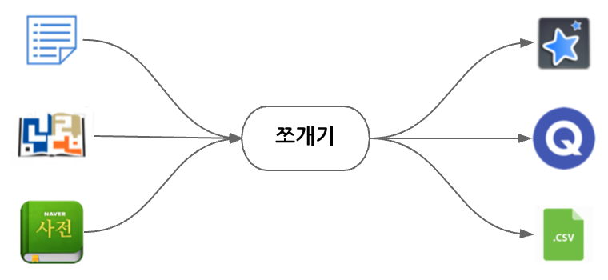

# jjogaegi (쪼개기)

Parses Korean vocabulary and formats items for easy importing from lists or dictionaries into [Quizlet](https://quizlet.com/), [Anki](http://ankisrs.net/), and other flashcard apps.



## Installation

First install [Go](https://golang.org/doc/install) and then install `jjogaegi`:

    $ go get github.com/ryanbrainard/jjogaegi

## Usage

`jjogaegi` is a small, sharp UNIX-like tool. As such, it only reads from stdin and writes to stdout, so it can be used in a pipeline. Use a command like `cat` or `pbpaste` to input a file or the clipboard, and then use redirection (i.e. `>`) or `pbpaste` to output back to a file or the clipboard.

#### File Based

For example, if there is a file named `input.txt` that looks like this:

```
•컴퓨터를 켜다 to turn on the computer
•브라우저를 열다 to open the web browser
•검색어를 입력하다 to type in the search word
```

It can be processed and written to `output.tsv` like this:

```sh
$ cat input.txt | jjogaegi > output.tsv
```

The resulting file will be in tab-separated format:

```tsv
컴퓨터를 켜다	to turn on the computer
브라우저를 열다	to open the web browser
검색어를 입력하다	to type in the search word
```

The output can then be imported into your favorite flashcard app.

#### Clipboard Based

Alternatively, if you'd rather work with just data from/to the clipboard, use `pbpaste` and `pbcopy` on MacOS:

```sh
$ pbpaste | jjogaegi | pbcopy
```

The examples above shows processing without any options. This processes a simple list and outputs a TSV by default; however, the parser for the input and formatter for the output can be customized. See examples and options below for details.

# Options

The parser and formatter can be set for different inputs and outputs.

## Parsers

Options for `--parser` flag:

 - `list`: (default) list of Korean terms followed by English definitions. Splits the line after the last 한글 character. Does not support 漢字.
 - `krdict-xml`: [한국어기초사전](https://krdict.korean.go.kr) Korean wordbook XML. Supports Id, 漢字, pronunciations, antonyms, and English definition fetching.
 - `naver-json`: [Naver Korean-English Dictionary](http://endic.naver.com/) wordbook JSON. Supports Id, 漢字. (experimental)
 - `naver-table`: [Naver Korean-English Dictionary](http://endic.naver.com/) wordbook printed PDF table. Supports 漢字. (experimental)

## Formatters

Options for `--formatter` flag:

 - `tsv`: (default) tab-separated values
 - `csv`: comma-separated values
 
## Hanja

Options for `--hanja` flag:

 - `none`: (default) do not include 漢字 with 한글
 - `parens`: output 漢字 in parenthesis next to 한글

## Header

Options for `--header` flag:

If set, string will be prepended to output

## Audio Dir

Options for `--audiodir` flag:

If set, audio will be downloaded into the directory specified

# Examples

The following are examples of using `jjogaegi` for common use cases:

## Importing 한국어기초사전 Word Books into Anki

The [National Institute of Korean Basic Dictionary (국립국어원 한국어기초사전)](https://krdict.korean.go.kr) allows word books to be downloaded in XML format, which are ideal for parsing with `jjogaegi` and creating flashcards.  The dictionary itself is designed for learners with simple definitions, audio samples, example sentences, and is translated into 10 languages. The word books can currently only be created in the Korean dictionary; however, `jjogaegi` will download the English definitions and Korean audio during processing. To keep flashcards simple, only the first definition and two examples are exported per entry.

Here's how to export XML from the dictionary:

1. [Create a login](https://krdict.korean.go.kr/login/privateForm).
1. [Sign in](https://krdict.korean.go.kr/login/login).
1. Search for a word and go to the entry. Be sure you are in the basic Korean dictionary, not the Korean-English dictionary.
1. Click **단어장에 추가** and follow the prompts to add the word to a word book.
1. Add more words.
1. Click **내 정보 관리** and then go to the **내 단어장** tab.
1. Select the words you want to export
1. Click **단어장 내려받기**, choose **XML**, and **내려받기**.
1. Go to the **사전 내려받기** tab.
1. Find the completed export and click **내려받기**.
1. Save the file to your computer (shown as `input.xml` below).

Now, you can use `jjogaegi` to convert the XML file into a TSV file for [Anki](https://apps.ankiweb.net/) . Make sure you have `jjogaegi` [installed](#installation) and run:

```sh
$ cat input.xml | jjogaegi --parser krdict-xml --header 'tags: example' --audiodir '/path/to/anki/media' > output.tsv
```

Let's break down this command a bit:

 - `cat input.xml |` prints the XML file and pipes it to the next command.
 - `jjogaegi` processes the XML with options:
     - `--parser krdict-xml` sets the parser for this dictionary.
     - `--header 'tags: example'` sets [tags for Anki](https://apps.ankiweb.net/docs/manual.html#adding-tags).
     - `--audiodir '/path/to/anki/media'` sets the the directory to download audio files. See [Anki file locations](https://apps.ankiweb.net/docs/manual.html#files) for details on what this should be set to on your computer.
 - `> output.tsv` save the output to a file.

Now, open Anki, go to **File**, **Import**, choose the TSV file and follow the wizard.

# Disclaimer

For personal use only. Do not use this tool for publishing copyrighted content. Respect copyright holders' rights of their content. Logos shown above are copyrighted by their respective owners.
